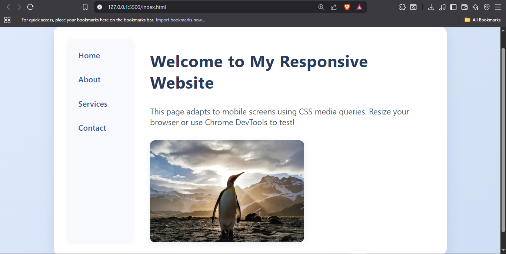
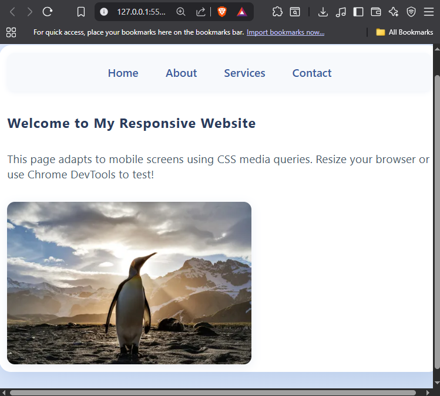

# Responsive Website Example

This project demonstrates a simple, modern responsive website layout using HTML and CSS. The design adapts to different screen sizes, making it suitable for both desktop and mobile devices.

## Features

- **Responsive Layout:** Uses CSS Flexbox and media queries to adjust the layout for mobile screens.
- **Navigation Bar:** Horizontal on desktop, switches to row on mobile.
- **Modern Styling:** Gradient background, card-style container, and subtle shadows.
- **Responsive Image:** Image scales and stays within its container, with a fixed width of 8cm on desktop.

## How to Use

1. **Open in VS Code:**  
   Open the `index.html` file in Visual Studio Code.

2. **Preview in Browser:**  
   Right-click the file and select "Open with Live Server" or simply open it in your browser.

3. **Test Responsiveness:**  
   - Resize your browser window.
   - Use Chrome DevTools (Ctrl+Shift+I, then toggle device toolbar) to test on mobile devices.

4. **Change the Image:**  
   - Replace `myimage.jpg` with your own image file.
   - Make sure your image is in the same folder as `index.html`.

## Customization

- **Change Colors:**  
  Edit the CSS in the `<style>` section to use your own color scheme.
- **Edit Content:**  
  Update the navigation links, headings, and text as needed.

## Folder Structure

```
task 4/
│
├── index.html
├── myimage.jpg   # (your image file)
```
##  Preview

_
_

##  Run Locally

1. Clone the repository:
   ```bash
   git clone https://github.com/yourusername/the-elevate-labs.git


## Author 
 - Aditi Bhatt - Frontend Developer